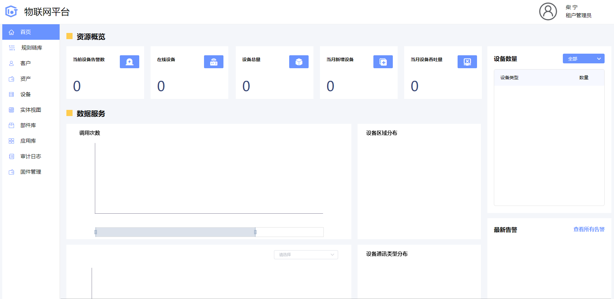
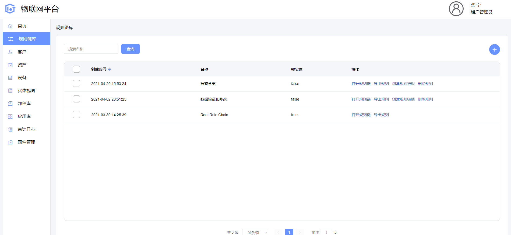
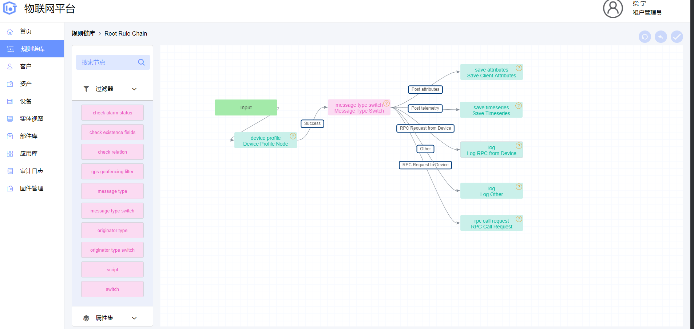
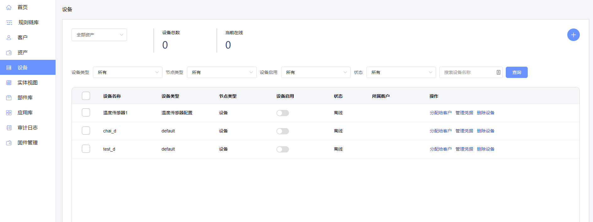
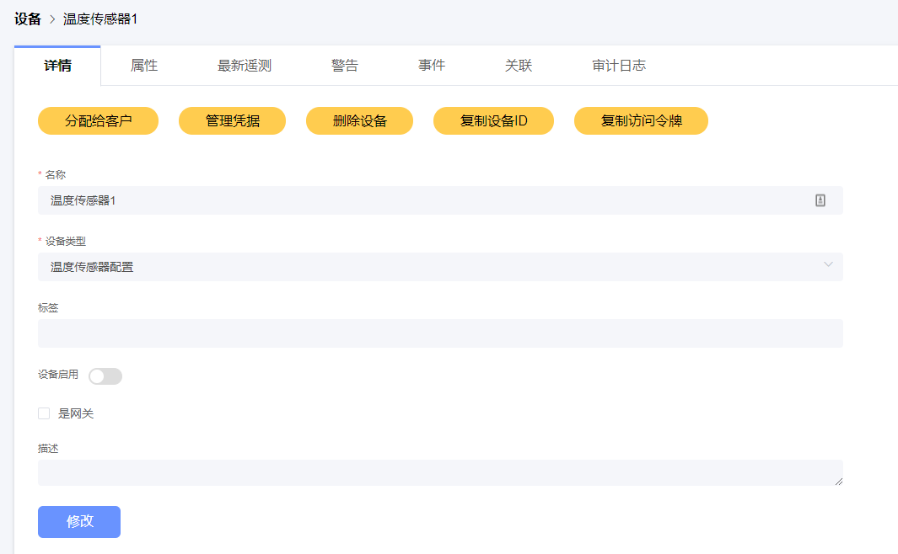
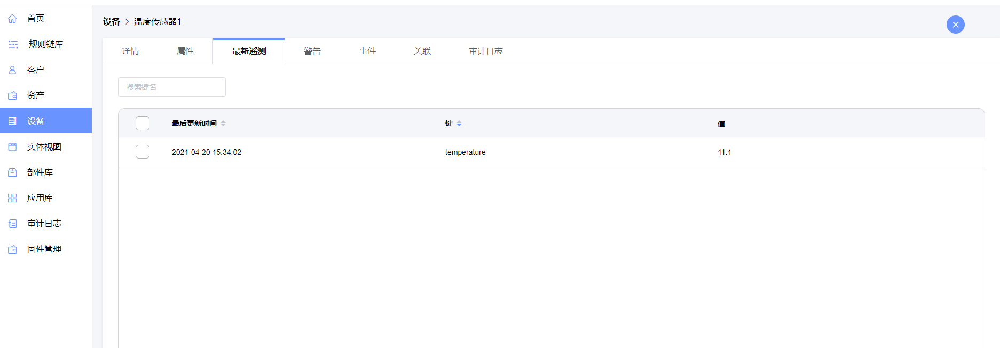

# thingsboard-ui-vue

首先感谢https://github.com/2498234498/IOT 开源项目，本项目后续基于该开源项目以及thingsboardV3.2.2进行二次开发

在众多开源IoT平台中，ThingsBoard凭借其优秀的性能和高效的性能得到了广大开发者的认可，但其界面却难以被国内开发者接受，因此对其前端开发出vue版本

gitee地址：https://gitee.com/chaining/thingsboard-ui-vue


## Project setup

```
yarn install
```

### Compiles and hot-reloads for development
```
yarn serve
```

### Compiles and minifies for production
```
yarn build
```

### Lints and fixes files
```
yarn lint
```

项目预览：












